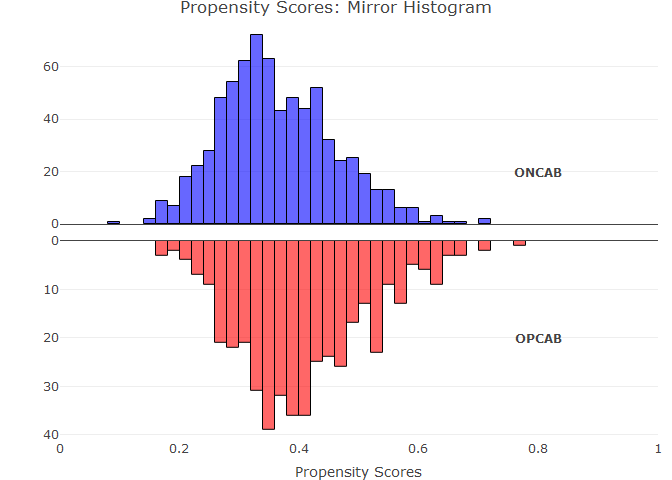
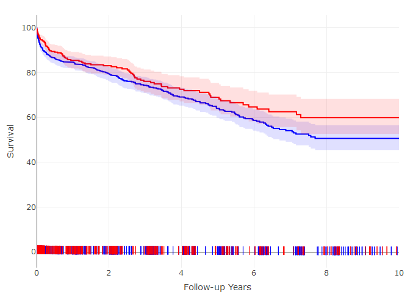
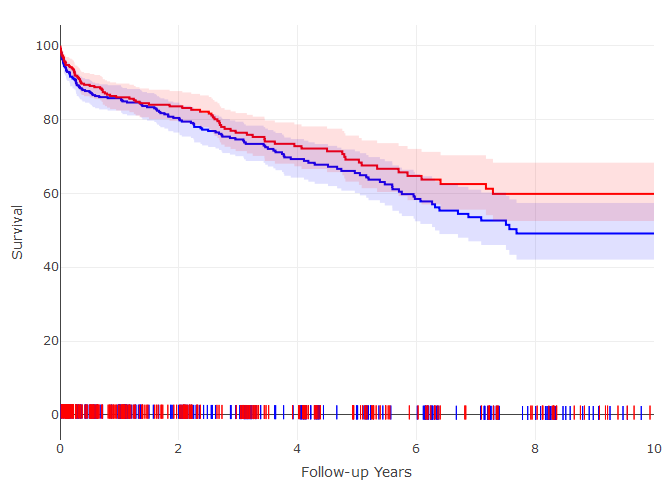
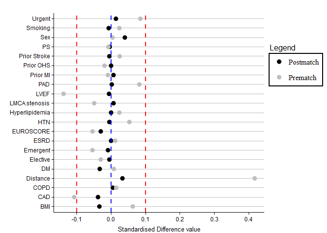

<!-- README.md is generated from README.Rmd. Please edit that file -->

### Off-pump coronary artery bypass grafting is safe and effective in patients with severe left ventricular dysfunction

Authors: Mateo Marin-Cuartas1, Salil V. Deo2,
Paulina Ramirez1, Alexander Verevkin1, Sergey
Leontyev1, Michael A. Borger1, Piroze M.
Davierwala1

<u>Affiliations:</u>

-   1 University Department of Cardiac Surgery, Heart Center
    Leipzig, Leipzig, Germany, 2 Louis Stokes Cleveland VA
    Medical Center, Department of Veterans Affairs, Cleveland Ohio,
    United States of America.

<u>Corresponding Author:</u>

Dr. Piroze M. Davierwala,

University Department of Cardiac Surgery,Heart Center
Leipzig,Struempellstrasse 39, 04289 Leipzig, Germany

Email: <pirarm@hotmail.com>

<u>Figures presented in the manuscript are recreated and presented here
as interactive graphs.</u>

<u>Main Manuscript:</u>

Figure 1.

<!-- -->

<u>Figure 2 A:</u>

<!-- -->

This figure panel presents the survival (with 95% confidence interval
bands) for OPCAB and ONCAB patients in the entire cohort. red = OPCAB ,
blue = ONCAB.

<u>Figure 2B:</u>

<!-- -->

This figure panel presents the survival (with 95% confidence interval
bands) for OPCAB and ONCAB patients in the matched groups, calculated
using the Kaplan-Meier method. Blue = ONCAB, Red = OPCAB

<u>Supplemental Section</u>

<u>Supplemental Figure 1:</u>

<!-- -->

This figure demonstrates the standardized difference for each co-variate
in the propensity score model. The gray dots represent the entire
cohort, and the black dots represent the 1:1 matched pairs cohort. After
matching, standardized difference for each covariate is between -0.1 and
0.1 demonstrating acceptable model balance. The variable “distance” on
the graphic represents the distance between propensity scores for
patients. BMI body mass index; CAD coronary artery disease; COPD Chronic
obstructive pulmonary disease; ESRD end-stage renal disease; HTN
arterial hypertension; LMCA left main coronary artery; LVEF left
ventricular ejection fraction; PAD peripheral artery disease; MI
myocardial infarction; OHS open heart surgery; PS propensity score.
